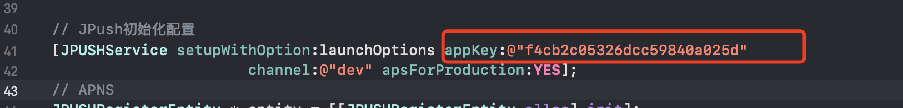

# react-native-template-life

An react natieve project template to help us improve our development efficiency.

## :star: Features

- Elegant usage directly within the [React Native CLI](https://github.com/react-native-community/cli)
- Integrate common functions of [React Navigation](https://reactnavigation.org/)
- Support theme switching
- [Android immersive status bar](https://github.com/gyf-dev/ImmersionBar)

## :arrow_forward: Usage

```sh
npx react-native init MyApp --template react-native-template-life
```

#### React Native <=> Template Version

| React Native  	| Template  	|
|---	            |---	        |
| 0.63  	        | 0.2.*       |
| 0.61  	        | 0.1.*       |

## 极光推送

模板项目中已经集成好了[极光推送](https://www.jiguang.cn/)，按照下面的步骤完成配置即可。

1. 在极光推送开发者平台创建应用。
2. 在`推送设置-集成设置`中完成 Android 和 iOS 端的设置。其中 Android 填写 ApplicationID，iOS 通过 `Token Authentication配置`完成鉴权。
3. 将模板中的 appKey 修改为实际应用的 appKey。

### Android

修改 `app/build.gradle` 中的 `JPUSH_APPKEY`。

### iOS

修改 `AppDelegate.m` 文件。



`[JPUSHService setupWithOption:launchOptions appKey:@"" channel:@"dev" apsForProduction:YES];` 

## 高德定位

1. 在高德开放平台中申请好应用的 key。
2. Android：修改 `AndroidManifest.xml` 中 `com.amap.api.v2.apikey` 的值为申请的 key。
3. iOS：修改 `Appdelegate.m` 中的 `[AMapServices sharedServices].apiKey = @"";` 改为申请的 key。